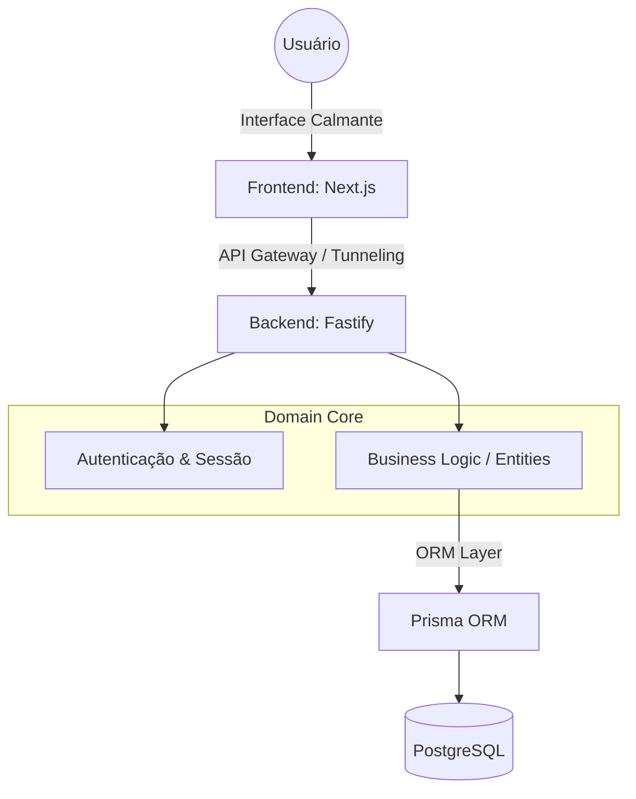

# SlowPace 🌿

## 📌 Sobre o Projeto
O SlowPace é um web app "anti-streak" projetado para entusiastas de hobbies e pessoas neurodivergentes. Diferente de ferramentas de produtividade saturadas que geram ansiedade através de gatilhos de punição, o SlowPace oferece um ambiente de "Arquitetura da Calma", focado na autorregulação, na redução da carga cognitiva e na valorização do processo contínuo em vez da performance exaustiva.

## 🏗️ Arquitetura e Engenharia
O projeto foi estruturado com foco em escalabilidade, manutenibilidade e resiliência, utilizando padrões de desenvolvimento de nível corporativo:

- **Clean Architecture**: Desacoplamento rigoroso entre camadas de interface, aplicação e domínio, permitindo a evolução do sistema sem acúmulo de dívida técnica.

- **Domain-Driven Design (DDD)**: Modelagem estratégica focada na experiência do usuário e gestão de tempo, garantindo que a lógica de negócio reflita necessidades reais.

- **Resiliência e Segurança**:

    - Arquitetura preparada para ambientes distribuídos com suporte a trustProxy.

    - Segurança em camadas com autenticação via JWT, hashing com BCrypt e conformidade com padrões modernos de cookies (SameSite=None, Secure).

    - Camada de persistência otimizada com Prisma ORM sobre PostgreSQL.

## 📊 Arquitetura do Sistema

## 🚀 Tech Stack
- **Frontend**: Next.js (React), Tailwind CSS, Shadcn/ui.

- **Backend**: Node.js, Fastify.

- **Database**: PostgreSQL, Prisma ORM.

- **Infrastructure**: Docker, Container-based deployment.

## 👥 Personas
O SlowPace foi desenvolvido pensando em:

- Pessoas Neurodivergentes (TDAH/TEA): Que sofrem com a sobrecarga sensorial de apps tradicionais.

- Profissionais em Burnout: Que buscam um refúgio para registrar o valor do seu tempo sem métricas tóxicas de produtividade.